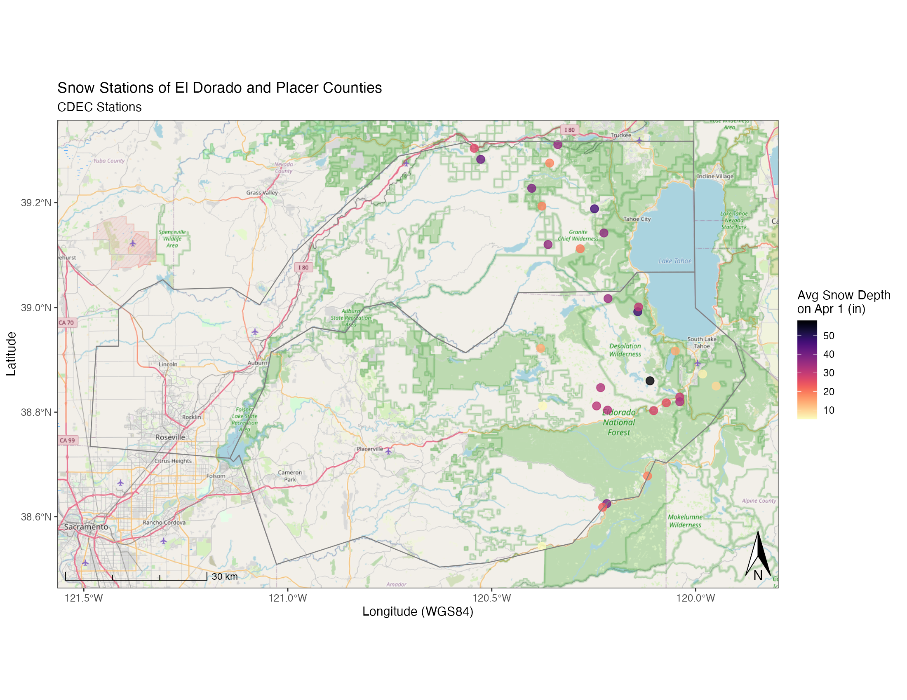

<br>

## Spatial Data and R

Typically we want to follow a general pipeline for getting data, cleaning it up, summarizing it, and then communicating that data as a story in some way. For more details, the excellent [R for Data Science](http://r4ds.had.co.nz/communicate-intro.html) open source and free-online book by Garrett Grolemund & Hadley Wickham gives a nice run down of the various components of this pipeline.


<br>

### Spatial/Mapping Libraries

One of the first good habits to get into is always load the functions or libraries you'll be using throughout your script, in the very beginning. It makes it easier for other folks who may want to run your code, or if folks need to go install some packages, they can do that first before getting half way through without realizing why the code is breaking.

There are many spatial/mapping libraries in R, too many to even cover. Be sure to check out the Resources page for some additional suggestions. However, these are the main spatial libraries I use all the time. I'm going to try to stick to for this demo, plus a few additional ones useful for getting data with geospatial components (hydrology, geography, weather, etc).

```{r loadlibseval, eval=T, include=F}

suppressPackageStartupMessages({
  library(sf); # reading in and writing shapes
  library(dplyr); # wrangling and summarizing data
  library(viridis); # a nice color palette
  library(measurements); # for converting measurements (DMS to DD or UTM)
  library(mapview); # interactive maps
  library(tmap); # good mapping package mostly for static chloropleth style maps
  library(ggspatial); # for adding scale bar/north arrow and basemaps
  library(ggrepel); # labeling ggplot figures
  library(ggforce); # amazing cool package for labeling and fussing 
  library(tigris); # ROAD/CENSU DATA, see also the "tidycensus" package
  library(USAboundaries); # great package for getting state/county boundaries
  library(sharpshootR);  # CDEC.snow.courses, CDECquery, CDECsnowQuery
  library(cowplot) ## MOOOOOOO!! for plotting
})

load("data/cdec_snow_courses.rda")

```

```{r loadlibs, echo=T, eval=F}

## TOOLS
library(sf) # reading/writing/analysis of spatial data
library(dplyr) # wrangling and summarizing data
library(viridis) # a nice color palette
library(measurements) # for converting measurements (DMS to DD or UTM)
library(mapview) # interactive maps
library(tmap) # good mapping package mostly for static chloropleth style maps
library(ggspatial) # for adding scale bar/north arrow and basemaps
library(ggrepel) # labeling ggplot figures
library(ggforce) # amazing cool package for labeling and fussing 
library(cowplot) ## MOOOOOOO!! for plotting multiple plots

## DATA
library(tigris) # ROAD/CENSU DATA, see also the "tidycensus" package
library(USAboundaries) # great package for getting state/county boundaries
library(sharpshootR)  # CDEC.snow.courses, CDECquery, CDECsnowQuery

```


### Load Data

Next, we want to read the data we'll be using for our project. For this example, we are going to use the `sharpshootR` package in R to load all [CDEC Snow Course](https://cdec.water.ca.gov/snow/) station locations, and plot them on a map.

```{r loaddata, eval=FALSE, echo=TRUE}

# load the snow data from sharpshootR package
data(CDEC.snow.courses) # data is a base function in R that loads data

```

<br>

## Tidy & Clean Data

Ok, so we have some data...but it needs some **tidying**. When we talk about "**tidy**" data, we mean one observation per row, and one variable per column (see here for [more info on tidy data](http://r4ds.had.co.nz/tidy-data.html)). Good news, there are some great tools in R we can use, including `dplyr` and `tidyr`. We can also check for missingness in our data using the [`naniar`](http://naniar.njtierney.com/) package.
 
Lets do a few things (the bolded words are `dplyr` functions)

 - check for missingness (how many variables have missing data?)
 - **`summarize`** data (tabulate or count over our rows/cols)
 - format data
 - **`rename`** columns
 - **`select`** data
 - **`filter`** data

### Check Missingness & Summarize

Let's see how many missing values exist for each column in our data frame.

```{r naniar, eval=TRUE, echo=TRUE}

# view missingness
library(naniar) # load the functions in this library

# with the data we loaded earlier, check for missing data graphically
gg_miss_var(CDEC.snow.courses,show_pct = T) 

# summarize
summary(CDEC.snow.courses) # tabulate each column

```

### Tidy

Now we can do a few things, including formatting our data/columns to different data types, renaming column names, and filtering/subsetting data.

```{r tidy, echo=TRUE, eval=TRUE}

# Make into a new dataframe
snw <- CDEC.snow.courses

# fix data formats...character/factor/numeric
str(snw)
snw$course_number <- as.factor(snw$course_number) # switch from numeric to factor for plotting

# rename a col:
snw <- snw %>% # create a "pipe" with (Ctrl or Cmd + Shift + M). 
  dplyr::rename(apr1avg_in=april.1.Avg.inches) # rename a column (new name = old name)

# summary of data:
summary(snw)
dim(snw) # how many rows and cols

# select/filter out the NA's from our dataset
snw <- dplyr::filter(snw, !is.na(apr1avg_in)) %>% 
  dplyr::select(-agency) # drop a column (agency)
dim(snw)

```

### Make Data Spatial (`sf`)

The `sf` package is amazing...it is becoming the workhorse for all things spatial. In this case, we'll use the `sf` package to quickly convert our point (X/Y) data into a spatial dataset we can work with (for more vignettes on the `sf` package, see [here](https://r-spatial.github.io/sf/)). Note here we specify column numbers, but could use column names as well to designate our X/Y information. Also, I already know this data is in WGS84 and is lat/lon in decimal degrees, so using the `crs/EPSG=4326` but you may need to look this up for your data if it's not part of the data. Most shapefiles already contain this information.

```{r makespatial, echo=T, eval=T, message=F, warning=FALSE}

# make spatial
snw_sf <- st_as_sf(snw, 
                   coords = c(6, 5), # can use col names here too, i.e., c("longitude","latitude")
                   remove = F, # don't remove these lat/lon cols from df
                   crs = 4326) # add projection
```

### Save Spatial Data Out

Great, now let's save it out! Good news, we can save/write/read a whole bunch of different file types with `sf`. For now, let's save this as a shapefile for later use. *Checkout saving to kml, geopackage, [geojson](https://github.com/ryanpeek/2018_river-rally-Rmapping-workshop/blob/master/data_output/all_cdec_snow_stations.geojson), etc on the sf website*. 

We can also download a shapefile or set of zipped files directly from a web URL. See example code below...

```{r saveOut, echo=TRUE, eval=FALSE}

# write shapefile out for use later
st_write(snw_sf, "data_output/all_cdec_snow_stations.shp", delete_dsn = TRUE)
st_write(snw_sf, "data_output/all_cdec_snow_stations.geojson", delete_dsn = TRUE)

# download a file from a url:
# download.file("https://github.com/ryanpeek/spatial_mapping_demo/blob/master/data/shps/cdec_snow_stations.zip?raw=true", destfile = "data/cdec_snow_stations.zip")

# unzip the file into your "data" folder
# unzip(zipfile = "data/cdec_snow_stations.zip", exdir = "data")

```
 
<br>


## Plotting Maps

### Simple Plot with `sf`

`sf` has it's on base plotting function, but we need to give it the `geometry` column so it knows what to plot. Remember since `sf` are simple data frames, this is easy to do with the `$`. 

```{r sfMap, echo=TRUE, eval=TRUE}

# plain sf map
plot(snw_sf$geometry)

# slightly fancier
plot(snw_sf["elev_feet"], graticule = TRUE, axes = TRUE, main="Snow Station Elevations (ft)")
```

### Using `tmap`

The `tmap` package is great and has some nice plotting options. Check out the [introduction vignette here](https://cran.r-project.org/web/packages/tmap/vignettes/tmap-getstarted.html).

```{r tmap, echo=TRUE, eval=TRUE, message=FALSE, warning=FALSE}

library(tmap)

tmap_mode("plot")
tm_shape(snw_sf) + 
  tm_layout(title = "Snow Station Elevations (ft)", frame=TRUE, inner.margin=0.1) +
  tm_compass(type = "8star", position = c(0.8, 0.8), size = 2) +
  tm_scale_bar(breaks = c(0, 50, 100), position = c("left", "bottom"),
               text.size = 0.7)+
  tm_symbols(col="elev_feet",title.col = "Elev (m)", n = 5, palette = viridis(n=5, direction = -1), size = .7)

```

<br>

## Clipping or Cropping Data

Before we make a nice interactive map, let's manipulate the data a bit more. For this example, let's grab some county boundaries and then select snow stations from only those counties, using the `st_intersection` command. For those familiar with ArcMap, this is essentially a clip or crop of an existing shapefile using a different shapefile.

We are pulling county data here from the `USAboundaries` package, and then loading some pre-cleaned/downloaded lake and stream shapefiles from the [HydroSHEDS database](http://hydrosheds.org/page/overview). Finally, we crop these data to our selected counties.

### Get Boundaries to Crop By

Get the county, watershed, rivers, lakes data.

```{r getRivCounty, eval=TRUE, echo=TRUE, message=FALSE, warning=FALSE}

# use library(USAboundaries) to get county data
counties_spec <- us_counties(resolution = "low", states="CA") %>% 
  filter(name=="El Dorado" | name=="Placer") # get counties only named El Dorado and Placer

```


### Read in from Geopackage

Haven't mentioned it much yet, but using the `.gpkg` format is a must! It's awesome, it is tidy, and it does away with so much of the pain of dealing with all the millions of different shapefile bits that are always hard to manage. Even better, it's open source and readable by ArcGIS, QGIS, etc., or as a straight SQLite database. Look for a separate lesson on this site just about geopackage. In the meantime, let's read in more data from a geopackage (on the github repo for this site).

```{r geopackage, eval=T, echo=T, purl=FALSE}

# read layers from a geopackage
st_layers("data/mapping_in_R_data.gpkg")

# using read_sf here for quiet defaults, but can use st_read as well...

# HUC8 watershed for Tahoe
h8_tahoe <- read_sf("data/mapping_in_R_data.gpkg", layer="h8_tahoe") 

# Lakes for all of CA/OR from HydroSHEDS
lakes <- read_sf("data/mapping_in_R_data.gpkg", layer="lakes_CA_OR_hydroshed")

# Rivers for all of CA/OR from HydroSHEDS
rivers <- read_sf("data/mapping_in_R_data.gpkg", layer="rivs_CA_OR_hydroshed")

```

### Crop the Data

To crop or clip our data, we use `st_intersection` and specify the data we want to crop *first* then the boundary we want to use to crop/clip by *second*. Both should be in the same projection, and note a warning will occur for lon/lat data types, but it will still work.

```{r cropData, eval=TRUE, echo=TRUE, message=FALSE, warning=FALSE}

# crop the snow stations to the counties of interest
snw_crop <- st_intersection(snw_sf, counties_spec)  # intersect these so we only keep snow stations in these selected counties

# crop rivers and lakes
rivers_crop <- st_intersection(rivers, counties_spec) # crop to our selected counties
lakes_crop <- st_intersection(lakes, counties_spec) # crop to our selected  counties

```

## Interactive/Dynamic Maps with `mapview`

This is the really fun part...we can quickly and easily plot any spatial data (in sf format) as an interactive map using the `mapview` package. For advanced mapview options, check out this [page](https://environmentalinformatics-marburg.github.io/mapview/advanced/advanced.html).

```{r mapview, eval=TRUE, echo=TRUE}
 
mapview(rivers_crop, color="steelblue", lwd=1.2, legend=FALSE) + 
  mapview::mapview(lakes_crop, legend=FALSE) +
  mapview(snw_crop, col.regions="maroon", layer.name="CDEC SNOW STATIONS") # make a map!

```

<br>

## Static Maps with Backgrounds (`ggplot` & `ggspatial`)

We can use the same data to build a static map, good for publications or presentations. For this we'll mainly use the `ggspatial` and `ggplot` packages.

Let's build a map and add some open source topo background maps. Note, this can take a while the higher the `zoom`. 


```{r ggspatial, echo=TRUE, eval=FALSE, warning=FALSE, message=FALSE}

library(ggspatial)

(niceMap <- ggplot() + 
    annotation_map_tile(zoom = 10, forcedownload = FALSE) + # this can take a few seconds the first time
    geom_sf(data=snw_crop, aes(color=apr1avg_in), alpha=0.8, size=3, inherit.aes = FALSE)+
    scale_color_viridis("Avg Snow Depth \non Apr 1 (in)", option="A", direction = -1)+
    geom_sf(data=counties_spec, fill = NA, show.legend = F, color="gray50", lwd=0.4, inherit.aes = FALSE) +
    labs(x="Longitude (WGS84)", y="Latitude",
         title="Snow Stations of El Dorado and Placer Counties",
         subtitle = "CDEC Stations") + 
    # spatial-aware automagic scale bar
    annotation_scale(location = "bl",style = "ticks") +
    # spatial-aware automagic north arrow
    annotation_north_arrow(width = unit(.3,"in"), 
                           pad_y = unit(.1, "in"),location = "br", 
                           which_north = "true") +
    # them
    theme_bw(base_family = "Helvetica"))

# to save this map:
ggsave(filename = "img/example_ggspatial_fig_snowdepth.png", width = 11, height=8.5, units = "in", dpi = 200)

```

```{r ggspatialMappingOut, eval=TRUE, echo=FALSE, out.height="100%", out.width="100%"}



```

### Add an Inset Map!

Cool! But what if we want to make publication-ready map? Often maps will need some sort of inset indication where your data is located more broadly to help readers orient themselves. Here's an example of how we may do that, adding one additional package, `cowplot` which allows us to combine *ggplots* very easily in different ways. First let's set up our inset map, in this case, a map of California with a box over our study area.

```{r getInset, eval=TRUE, echo=TRUE}

library(USAboundaries) # get outline of CA


CA <- us_boundaries(type="state", resolution = "high", states="California")

# make a grid box for where our localities are, use n=1 to make single polygon
sites_box <- st_make_grid(snw_crop, n = 1) # mapview(sites_box) to verify

# set margins:
par(mai=c(.1,0.1,0.1,0.1))

# now make map
(ca_map <- ggplot() + 
    geom_sf(data = CA, fill=NA) + 
    geom_sf(data=sites_box, col="black", fill="gray40") +
    coord_sf(datum = NA) + # to rm gridlines and axes
    theme_nothing()+ # from cowplot
    labs(x = NULL, y = NULL) +
    theme(
      #panel.grid = element_blank(), # remove gridlines,
      #plot.margin = unit(c(0.1, 0.1, 0, 0), "cm"),  #top, right, bottom, left
      panel.background = element_rect(color = "black", size=1, linetype = 1))+
    ylab("") + xlab(""))
    
```

Now we have an inset map we can use, it's simple, but should do the trick. Now let's add our nice map from before using some `cowplot` functions (`ggdraw` and `draw_plot`). It can take some adjusting and replotting to get the positioning just right...the x/y are relative to the overall plot, so `x=0.5` and `y=0.5` would be right in the middle.


```{r mapWithInset, echo=TRUE, eval=FALSE}

# library(cowplot) ## MOOOOOOO!!

(map_with_inset <-
    ggdraw(niceMap) +
    draw_plot(ca_map, x = 0.05, y = 0.6, width = .2, height = .2))
 
ggsave("img/example_ggspatial_site_map_w_inset.pdf", width = 10, height = 8, units = "in", dpi=300, device = cairo_pdf)

ggsave("img/example_ggspatial_site_map_w_inset.png", width = 10, height = 8, units = "in", dpi=300, type = "cairo")

```

```{r ggspatialInsetOut, eval=TRUE, echo=FALSE, out.height="100%", out.width="100%"}

knitr::include_graphics("img/example_ggspatial_site_map_w_inset.png")

```