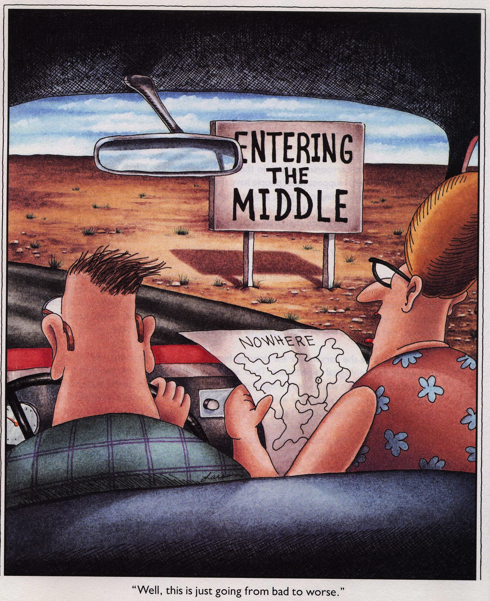

   

## Mapping In R

Analyzing and mapping data is a critical step in telling a story for any project. We want to know how to provide spatial information in a clear and concise way so any reader can extract the important bits. Communicating the details visually is sometimes a difficult task, made more complicated by the influx of tools and methods available. **_But_**... open-source programs like R (and RStudio) have made huge strides towards replacing other geospatial software. This site is geared towards providing some tools, tips, and tricks to use R/RStudio for mapping. These tools have improved immensely over the recent years, and now provide a powerful and flexible approach to reproducible mapping and visualization. Even better, it's easier and more efficient because you can re-use your code, and see all the steps that took place. 

## What is this Site?

This isn't meant to be all comprehensive! There are many other great resources (see the resources page) that are worth checking out. What this site is intended for, is folks interested in visualizing spatial data, making maps, and in particular, folks who work with water or natural resource data. Things I've tried to include are common tasks that I find myself looking up repeatedly, or useful analyses that are commonly done in most projects. Generally most of this site is geared toward vector based data (lines, points, polygons), but there are some tips for working with raster based datasets. Things covered include:

 - reading/saving spatial data in R (shps, rasters, kml/kmz, geopackage, mdb)
 - spatial operations commonly used in GIS programs (intersect, clip, buffer, crop, join, select)
 - make maps with data in both static and dynamic form
 - make maps with insets or backgrounds (like terrain/topo)
 - watershed analysis

## Knowing Where to Go

This isn't meant to be the in-depth deep-dive in geospatial analysis in R. It is hopefully, a gentle introduction to some of the more commonly used tools that will help folks go from the "middle of nowhere" to the outskirts of town, or if I continue to take this analogy too far, a gas station where you can learn more and advance farther. 

