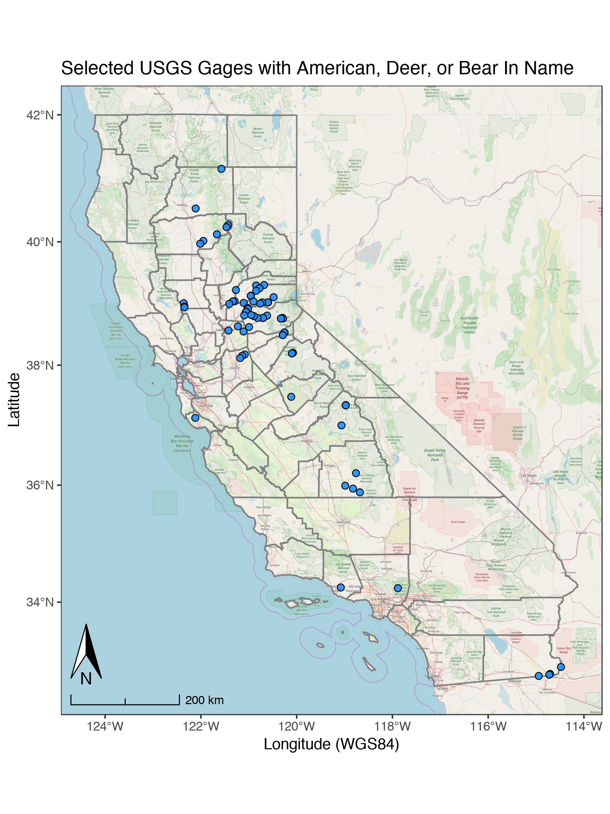

<br>

## Working with `kml` Files

`kml` files are the unzipped versions of `kmz` files. You can use the `sf` package to read `kml`'s. You'll want to unzip with any sort of zip package you have on your computer (Keka, 7zip, etc.). Data used in this example live in the github repo [here](https://github.com/ryanpeek/mapping-in-R-workshop/blob/master/data/streamgages_06.kml).

```{r loadlibraries, eval=T, echo=T}

suppressPackageStartupMessages({
  library(ggplot2)
  library(dplyr)
  library(sf);
  library(stringi)
  })

# https://waterwatch.usgs.gov/?m=stategage
gages <- st_read("data/streamgages_06.kml") # reads kml but not kmz


```

<br>

### Cleaning/Removing `html` tags

Once we have the data in, we still need to clean up some of the `html` bits that we don't want. We can use some text/string functions to deal with this in R. `gsub` and `substr` are great functions for fixing/replacing text.

```{r cleanhtml, eval=T, echo=T}

# pull out relevant info (remove html tags)
gages$name <- gsub(pattern="<.*?>", "", gages$Name)
gages$details <- gsub(pattern="<.*?>", "", gages$Description)
gages$site_no <- substr(gages$name, start = 1, stop = 8)
gages$site <- substr(gages$name, start = 10, stop = nchar(gages$name))
gages$date_s <- substr(gages$details, start=13, stop=22)
gages$date_e <- substr(gages$details, start=32, stop=nchar(gages$details)-1)
gages <- gages %>% dplyr::select(site_no:date_e)
gages$gageID <- paste0("T", gages$site_no)

# grep all sites with "AMERICAN", "DEER" or "BEAR" in site name
gages_FILTER <- filter(gages, grepl(pattern = "AMERICAN|DEER|BEAR",site))

```

### A Basic `ggplot`

Here we can make a basic `ggplot` with no specific background to our spatial data. We can still sort of make out an outline of California, but it would be nice to add some more details.

```{r simpleMapCA, echo=T, eval=F}

# simple map
ggplot() +
  labs(x="Longitude (WGS84)", y="Latitude",
       title="USGS Gages in CA") + 
  geom_sf(data=gages, col="blue", lwd=0.4, pch=21) +
  theme_bw()

```

```{r simpleMapHidden, eval=F, echo=F}

ggplot() +
  labs(x="Longitude (WGS84)", y="Latitude",
       title="USGS Gages in CA") + 
  geom_sf(data=gages, col="blue", lwd=0.4, pch=21) +
  theme_bw(base_family = "Roboto Condensed")


ggsave(filename = "img/usgs_gages_in_ca.png", width = 6, height = 8, units = "in", dpi = 150)

```


```{r simpleMapPlot, echo=F, out.width = "80%"}
library(knitr)
include_graphics(path = "img/usgs_gages_in_ca.png") 
```

### Add a Map Details/Background

Now we can add a few additional details here. Let's use the `USAboundaries` package go get a county layer, and the `ggspatial` package to add a scale bar, north arrow, and open source map background. Note, we could also just throw this `sf` layer into `mapview` (see the mapview page) and have an interactive map.

First let's get the county layer:
<!--
Not including this for now as we don't need to label this example:

counties <- us_counties(resolution = "high", states="CA") %>% # list states
  # add centroid values for labels
  mutate(lon=map_dbl(geometry, ~st_centroid(.x)[[1]]), 
         lat=map_dbl(geometry, ~st_centroid(.x)[[2]]))
-->


```{r getCounties, eval=F, echo=T, message=FALSE, warning=FALSE}

# now with background
library(ggspatial)
library(USAboundaries)
library(purrr)

counties <- us_counties(resolution = "high", states="CA")

```

Next we use the `ggspatial` package to add background (change the `zoom=` to a different value to change level of detail, but beware higher values take longer to download) using the `annotation_map_tile` function. Then add `annotation_scale` and `annotation_north_arrow` options to make the map look complete! 

```{r FancyMapping, eval=F, echo=T, message=FALSE, warning=FALSE}

# water color version 
ggplot() +
  annotation_map_tile(zoom = 8) + # this can take a few seconds
  geom_sf(data=counties, fill=NA, col="gray50", alpha=0.7) +
  scale_color_viridis_d() +
  labs(x="Longitude (WGS84)", y="Latitude",
       title="Selected USGS Gages with American, Deer, or Bear In Name") + 
  geom_sf(data=gages_FILTER, fill="dodgerblue", alpha=0.9, pch=21, size=2) +
  # spatial-aware automagic scale bar
  annotation_scale(location = "bl",style = "ticks") +
  theme_bw() +
  # spatial-aware automagic north arrow
  annotation_north_arrow(width = unit(.3,"in"), 
                         pad_y = unit(.3, "in"),location = "bl", 
                         which_north = "true")

```

```{r FancyMappingOut, eval=T, echo=F, out.height="100%", out.width="100%", fig.retina = 1.5}



# ggsave(filename = "img/selected_usgs_gages_w_deer_amer_bear_zoom8.pdf", 
       # width=6, height = 8, units = "in", dpi = 300, device = cairo_pdf)
# ggsave(filename = "img/selected_usgs_gages_w_deer_amer_bear_zoom8.png", 
#        width=6, height = 8, units = "in", dpi = 300, type = "cairo")
```


