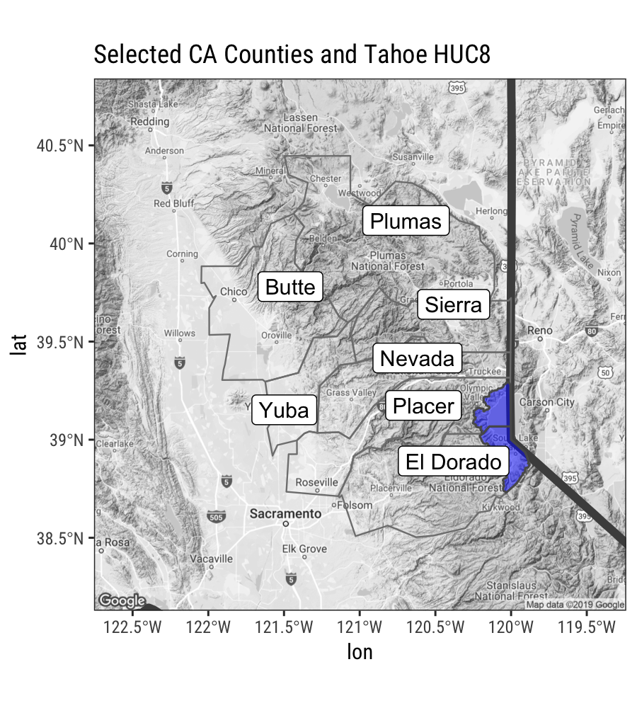

<br>

## Using Shapefiles with `rgdal` and `sf`

There are loads of spatial mapping/plotting packages in R. The main two ways to read in spatial data use the `rgdal` package, and the `sf` package. Let's look at how to load/plot line and polygon data.

**Let's load packages first:**

```{r loadlibsHidden, echo=TRUE, eval=FALSE, warning=FALSE}

library(rgdal); # spatial/shp reading
library(dplyr); # wrangling data/plotting
library(readr);
library(viridis); # nice color palette
library(sf); # newer "simple features" spatial package
library(USAboundaries); # state/county data
#library(Imap); # nice mapping/color functions col.map
library(ggrepel) # for labeling

```

```{r loadlibsOut, eval=TRUE, echo=FALSE, warning=FALSE}

suppressPackageStartupMessages({
  library(rgdal); # spatial/shp reading
  library(dplyr); # wrangling data/plotting
  library(readr);
  library(viridis); # nice color palette
  library(sf); # newer "simple features" spatial package
  library(USAboundaries); # state/county data
  #library(Imap); # nice mapping/color functions
  library(ggrepel); # for labeling
  library(here); # for pathnames
  library(knitr)
  }) 

```

## Polyline/Polygons Shapefile Data

I've downloaded some HUC watershed boundaries from the Lake Tahoe area in California, they are [here](https://github.com/ryanpeek/mapping-in-R-workshop/blob/master/data/h8_tahoe.zip) on github. Download the zipped file and unzip it in a `data` folder. We're going to use *`shapefiles`* for the remainder of this example. 

### Load shapefiles with `rgdal`

Let's load a polyline or line shapefile of rivers of California and Oregon. The result is a `SpatialPolygonsDataFrame` in your R environment.

```{r shapesRGDAL, echo=T, eval=T}

# we can use ogrInfo to see CRS, attributes, etc.
ogrInfo(dsn="./data", layer="h8_tahoe") # see shapefile info

# then read in the shapefile
hucs_sp<- readOGR(dsn = "./data", layer = "h8_tahoe") # takes a few seconds!

proj4string(hucs_sp) # check projection, should be WGS84


```

### Load shapefiles with `sf`

Here's how to do the same thing using the `sf` package. Notice two important differences, the `sf` package reads things in as a regular dataframe, with the spatial component of the data contained inside a `geometry` **list-column** within the dataframe. That means you can operate on this data as you would any data frame. The other main difference, is that reading shape data in is much faster with `sf`.  

```{r shapes_sf, echo=T, eval=T}

# notice the simple structure, but results in dataframe
hucs_sf <- st_read("data/h8_tahoe.shp") # fast!

# check crs
st_crs(hucs_sf)

```

## Polygon Shapefile Data

No different here, process is the same. But let's take a look at a package that might be helpful for folks working with state/county boundaries.

### Download State/County Data

A nice package for pulling county/state data is the `USAboundaries` package. Importantly, this package pulls these data in as `sf` features (`dataframes`), not as `rgdal` or `SpatialPolygonDataFrames` data.

Let's show this in two steps, the first is how to grab a `sf` feature for a given state or states.

```{r getStateData, echo=T, eval=T}

library(USAboundaries)

# Pick a State
state_names <- c("california")

# Download STATE data and add projection
CA<-us_states(resolution = "high", states = state_names)

st_crs(CA)

```

That was easy...what about counties? We can use the same type of call, but let's add some `dplyr` and `purrr` functionality here to add the X and Y values for the centroid of each polygon (county) we download. In this case we use `map_dbl` because it will take a vector or values (the `geometry` col here), map a function over each row in that vector, and return a vector of values (the centroid points).

```{r getCountiesData, echo=T, eval=T}

library(purrr)

# Pick some CA counties
co_names <- c("Butte", "Placer", "El Dorado", "Nevada", "Yuba", "Sierra", "Plumas")

# get COUNTY data for a given state
counties_spec <- us_counties(resolution = "low", states=state_names) %>% # use list of state(s) here
  filter(name %in% co_names) %>% # filter to just the counties we want
  # add centroid values for labels using the geometry column
  mutate(lon=map_dbl(geometry, ~st_centroid(.x)[[1]]), 
         lat=map_dbl(geometry, ~st_centroid(.x)[[2]])) 

```

<br>


### Make a Basic Map

First let's show a few examples comparing how to plot the dataset using `sf`.

```{r sf_base, echo=T, eval=T}

plot(st_geometry(hucs_sf), col="darkblue", 
     main="Tahoe HUC8", axes=TRUE)

# this is same
# plot(hucs_sf$geometry), col="darkblue", main="Tahoe HUC8")

```

<br>

## Advanced Mapping

Okay, let's add in the county/state data, and figure out a few tricks to making our map a bit cleaner.

### Layering Maps: `plot` and `sf`

```{r plot_sf, eval=T, echo=T}

# note adding some alpha adjustment here and using "cex" to make larger
plot(counties_spec$geometry, col=adjustcolor("maroon", alpha=0.5), cex=1.5, axes=TRUE, main="Selected CA Counties")

# now add tahoe HUC8 to existing plot, with add=TRUE
plot(hucs_sf$geometry, col=adjustcolor("blue", alpha=0.7), add=TRUE)

# now add some labels using the centroid lat/long we added earlier
text(counties_spec$lon, counties_spec$lat, labels = counties_spec$name)


```

Unforunately this map isn't very good. How can we improve it? Seems it would be nicer to crop the river layer to the counties of interest, or at least center things on that area. Also might be nice to have the labels on top and not obscured by the rivers.

```{r relayering}

# get range of lat/longs from counties for mapping
mapRange1 <- st_bbox(counties_spec) # view bounding box

# add counties
plot(counties_spec$geometry, col=adjustcolor("maroon", alpha=0.5), cex=1.5,
     xlim=mapRange1[c(1,3)], ylim = mapRange1[c(2,4)], axes=TRUE, 
     main="Selected CA Counties and Tahoe HUC8")

# add HUC
plot(hucs_sf$geometry, col=adjustcolor("blue", alpha=0.7), add=TRUE)
     
# add labels for counties
text(counties_spec$lon, counties_spec$lat, labels = counties_spec$name,
     col=adjustcolor("white", alpha=0.8), font = 2)


```

That's a little better...but still not quite what we want. Lots of extra ink going toward stuff that we don't need (i.e., watershed boundary outside of counties). What about cropping the watershed layer to our county layer (just for fun)?

<br>

### Cropping & Buffering with `sf`

Great thing is that `sf` has some really nice tools for this, just as any GIS program would.  Here let's use `st_intersection` to crop our watershed layer to only include the part inside the counties of interest.

```{r crop_sf}

# crop watershed by counties
hucs_sf_crop <- st_intersection(hucs_sf, counties_spec) # warning is ok

# plot
plot(hucs_sf_crop$geometry, col="blue") # a quick plot check to make sure it worked

# buffer a single county? Warning is ok as well...has to do with lat/lon
county_buff <- st_buffer(counties_spec[counties_spec$name=="El Dorado",], dist = .05) # note this is a buffer of decimal degrees

# now plot
plot(counties_spec$geometry, axes=TRUE)
plot(county_buff$geometry, border="maroon", col=adjustcolor("maroon", alpha=0.5), add=TRUE)
plot(hucs_sf_crop$geometry, col="blue", add=TRUE)


```

Great, let's try our plot again.

```{r cropRelayer}

# try again, let's switch layer ordering
plot(counties_spec$geometry, col=adjustcolor("maroon", alpha=0.2), cex=1.5, axes=TRUE, main="Selected CA Counties")
plot(hucs_sf_crop$geometry, col=adjustcolor("blue", alpha=0.7),add=TRUE)
plot(CA$geometry, add=TRUE, lwd=2)
text(counties_spec$lon, counties_spec$lat, labels = counties_spec$name,
     col="maroon", font = 2)
```

Ok! Not bad. What could we improve?

<br>

### Using `ggplot2` and `sf`

We can use `ggplot2` to plot our `sf` data! Many more options using this platform for `sf`. Mapping with `ggplot2` brings some extra things we can fiddle with. Since these data are all data.frames (`sf` features), we can use the `geom_sf` function.

One important note...there's a common error that you may get semi-regularly, which will look something like this:

```
Error in grid.Call(C_textBounds, as.graphicsAnnot(x$label), x$x, x$y,  : 
  polygon edge not found
```

Don't worry about this, it has to do with the `grid` package...it's annoying but all you need to do is replot your map/figure (sometimes several times) and eventually the plot will work/show up.

```{r ggplot_map1}

library(ggplot2)
library(ggrepel)

# quick test of just CA
ggplot() + geom_sf(data = CA)

# not cropped
ggplot() + 
  geom_sf(data=CA, color = "gray30", lwd=2, fill=NA) + # California border
  geom_sf(data=counties_spec, fill = NA, show.legend = FALSE, color="gray50", lwd=0.4) + # counties
  geom_label_repel(data=counties_spec, aes(x=lon, y=lat, label=name)) +
  theme_bw()

```

Great, this is a nice example...but what if we want to crop to the area of interest like we did previously with the `st_bbox`? Well, we can add a call to the `coord_sf()` to limit the range we're interested in. Let's also add an "annotation" to our map to delineate the CA state line.

```{r ggplot_map2, eval=T, echo=T}

# with cropped range (to only our selected counties)
ggplot() + 
  geom_sf(data=CA, color = "gray30", lwd=2, fill=NA) +
  geom_sf(data=counties_spec, fill = NA, show.legend = F, color="gray50", lwd=0.4) +
  geom_sf(data=hucs_sf_crop, fill="blue", alpha=0.5, size=0.5)+
  geom_label_repel(data=counties_spec, aes(x=lon, y=lat, label=name)) +
  coord_sf(xlim = mapRange1[c(1,3)], ylim = mapRange1[c(2,4)]) +
  theme_bw(base_family = "Helvetica") + # change to "sans" if this font not available
  labs(title="Selected CA Counties and Tahoe HUC8")+
  theme(panel.grid.major = element_line(color = "gray80", linetype = 1)) + # change grid
  annotate("text", x=c(-120.1,-119.9), y=40.3, label=c("CA","NV"), color="gray40", size=3, fontface=2, angle = 90)

```

### `ggmap` Background

Another option is to use the `ggmap` package...which unforunately also requires you register for an API key...which is a bit longer of a process than I have time to go into. Suffice to say, follow the steps outlined on the [`ggmap` repository](https://github.com/dkahle/ggmap).

```{r ggmapEx, eval=F, echo=T}

library(ggmap)
location=c(-121,39.5) # set the center of the map
# set the background map up
map1 <- get_map(location=location, crop = F,
             color="bw",
             maptype="terrain",
             source="google",
             zoom=8)


ggmap(map1) +
  geom_sf(data=CA, color = "gray30", lwd=2, fill=NA, inherit.aes = F) +
  geom_sf(data=counties_spec, fill = NA, show.legend = F, color="gray50", lwd=0.4, inherit.aes = F) +
  geom_sf(data=hucs_sf_crop, fill="blue", alpha=0.5, size=0.5, inherit.aes = F)+
  geom_label_repel(data=counties_spec, aes(x=lon, y=lat, label=name)) +
  theme_bw(base_family = "Roboto Condensed") + 
  labs(title="Selected CA Counties and Tahoe HUC8")

```


```{r ggmapPlot, eval=T, echo=F, out.height="100%", out.width="100%"}

# ggsave(filename = "img/ggmap_spatial_poly_example.png", width = 4.5, height = 5, units = "in", dpi = 200)



```


### Interactive maps 

We can add our `sf` data directly into a [*leaflet*](https://rstudio.github.io/leaflet/) map using the `mapview` package.

```{r mapview, echo=T, eval=T}

library(mapview)

m1 <- mapview(counties_spec, fill=NA)
m2 <- mapview(hucs_sf)

# combine using the ggplot style "+"
m1 + m2
```


## Put it All Together

 - Can you crop to a single county and plot the rivers and county? 
 - How might you make an inset in your map? (hint...see [here](https://ryanpeek.github.io/2016-09-28-static_maps_in_R/))
 - What about buffering outside of the selected counties by 30 km?
 - Can you add some points? Try adding a point at **39.4 N and 121.0 W**.
